# Celestial Bodies Database

This project contains SQL (PostgreSQL) scripts to create and populate a database about celestial bodies, including galaxies, stars, planets, moons, and observations.

## This is a working real-world project for a freeCodeCamp Relational Database certification.

**To complete the project I had to complete all of these tasks:**

1. Create a database name **universe**.
1. Connect to your universe database.
1. Add tables named **galaxy, star, planet, and moon**.
1. Each table should have a **primary key**, Each primary key column should follow the naming convention table_name_id. For example, the **moon table** should have a primary key column named **moon_id**.
1. Each table should have a **name** column.
1. Each table should have a column that has a **unique** constraint.
1. The table should have at least 2 column that has **boolean** data-type.
1. You should use the **TEXT** data-type at least once.
1. You should use the **INT** data-type for at least two columns that are not a primary or foreign key.
1. Each table must have at least **5 columns**.
1. Each **star** in the star table must have a foreign key that reference one row in **galaxy** table.
1. Each **planet** in the planet table should have a foreign key that references one of the rows in **star** table.
1. Each **moon** in the moon table should have a foreign key that references one of the rows in **planet** table.
1. There should be atleast **5 tables** in the dataset,

There was no instruction like how the schema of the table should like of the fifth table it was meant to be done by your own creative thinking so I choose to create the observation table.

## Files

- `create_tables.sql`: SQL script to create tables for **galaxies, stars, planets, moons, and observations**.
- `insert_data.sql`: SQL script to insert sample data into the tables.
- `README.md`: This file, providing an overview of the project.

## Structure

- **Galaxy Table**: Stores information about galaxies such as name, presence of life, spherical shape, etc.
- **Star Table**: Contains data on stars including name, type, age, mass, brightness, etc.
- **Planet Table**: Includes details about planets like name, type, existence of life, distance from star, etc.
- **Moon Table**: Records information about moons orbiting planets, including name, radius, orbital period, surface composition, etc.
- **Observation Table**: Tracks observations made about celestial bodies, noting the planet observed, observation date, and details.

## Usage

1. **Setup Database**: Execute `create_tables.sql` to create the database schema.
2. **Populate Data**: Run `insert_data.sql` to populate the tables with sample data.
3. **Queries**: Use SQL queries to retrieve information from the database, e.g., planets orbiting a specific star or moons orbiting a planet.

## Here are some screenshots

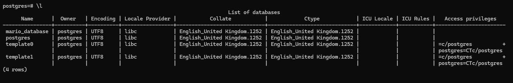
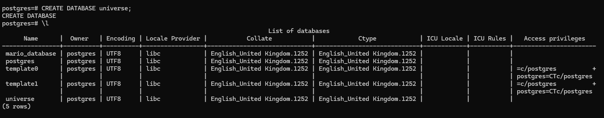
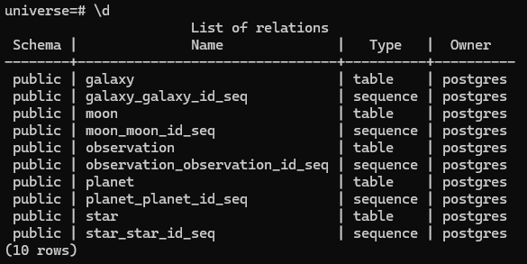
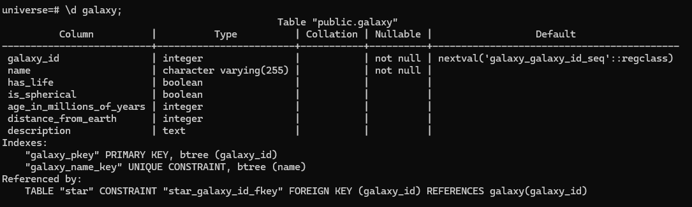
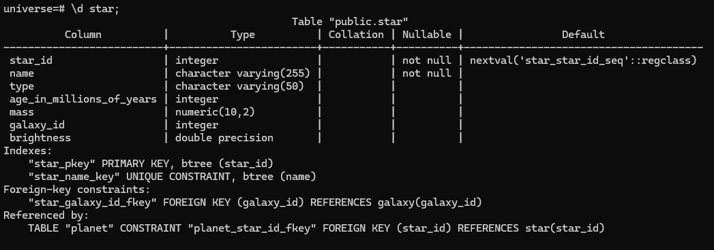
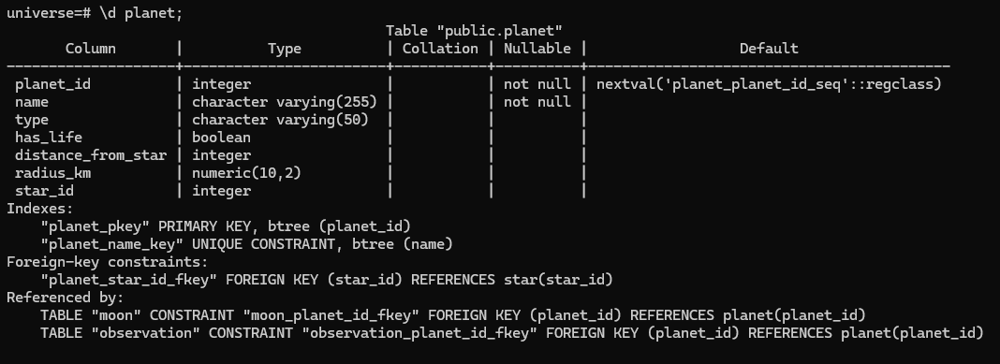
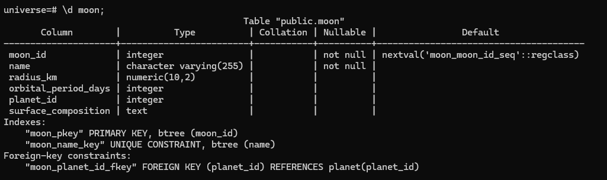
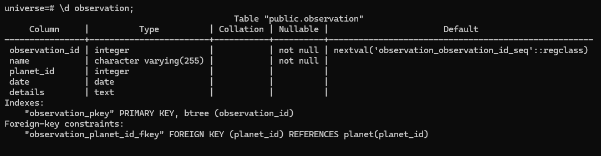
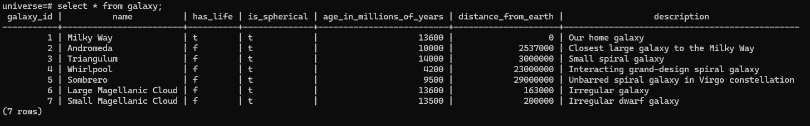
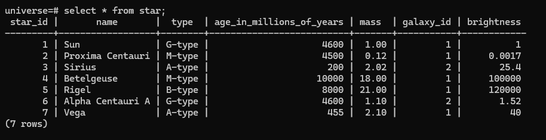
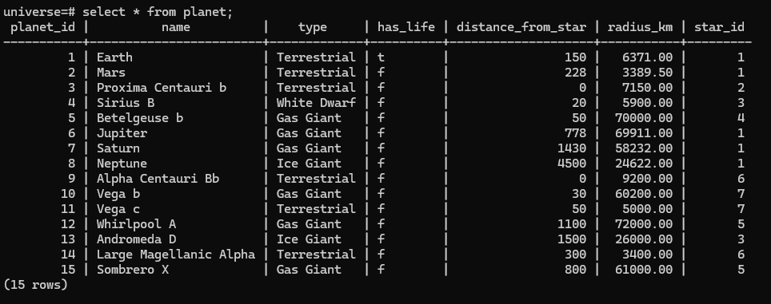
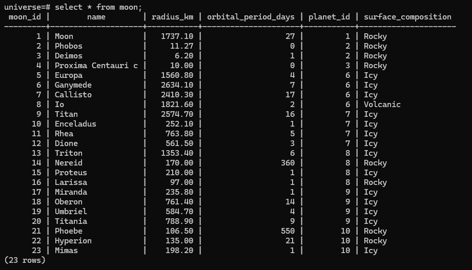
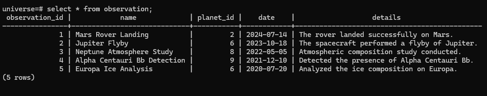

## License

This project is licensed under the MIT License - see the LICENSE file for details.
